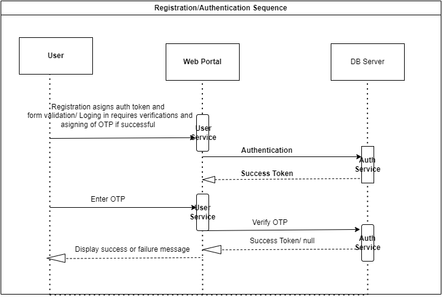
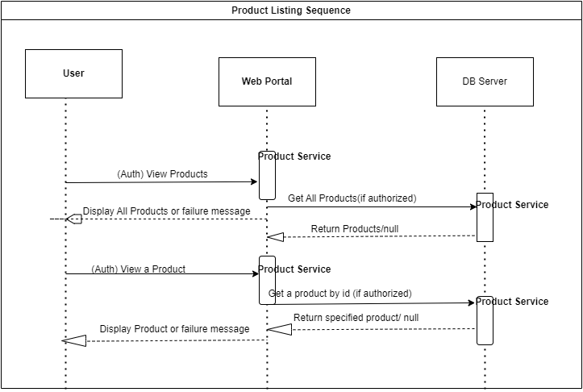
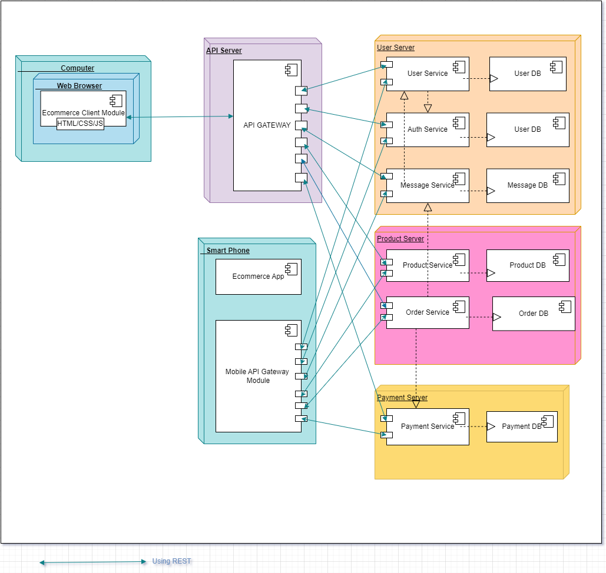

# System Design: A scalable Microservice-based system for a simple eCommerce platform

## Component Diagram

.png>)

## Sequence Diagrams

.png>)

## Deployment Diagram

### Component Descriptions

User Service
Responsibilities: Manages user accounts, handles authentication, and stores user information.
Database: Stores user data (e.g., user profiles, authentication tokens).
Endpoints:
POST /register: Register a new user.
POST /login: Authenticate a user.
GET /profile: Retrieve user profile.

Product Service
Responsibilities: Manages product listings, stores product details, and handles inventory management.
Database: Stores product data (e.g., product descriptions, prices, stock levels).
Endpoints:
GET /products: Retrieve all products.
GET /products/{id}: Retrieve product details.
POST /products: Add a new product.
PUT /products/{id}: Update product details.
DELETE /products/{id}: Delete a product.

Order Service
Responsibilities: Manages orders, handles transactions, and coordinates with payment and notification services.
Database: Stores order data (e.g., order details, transaction status).
Endpoints:
POST /orders: Place a new order.
GET /orders/{id}: Retrieve order details.
GET /orders/user/{userId}: Retrieve orders by user.

### Communication Between Services

REST: Used for synchronous communication between services (e.g., User Service to Auth Service).
gRPC: Used for high-performance inter-service communication, especially where low latency is required.
Messaging (Kafka): Used for asynchronous communication, ensuring reliable message delivery and decoupling service dependencies.
Data Consistency
Two-Phase Commit: Ensures that transactions spanning multiple services either commit or rollback together.
Eventual Consistency: Used where strict consistency is not required, allowing for high availability and partition tolerance.

### Data Consistency

Two-Phase Commit: Ensures that transactions spanning multiple services either commit or rollback together.
Eventual Consistency: Used where strict consistency is not required, allowing for high availability and partition tolerance.
Fault Tolerance

Circuit Breakers: Prevent cascading failures by stopping attempts to communicate with a failing service.
Retries: Automatically retry failed operations with exponential backoff.
Fallbacks: Provide alternative responses or actions when a service is down.

Scaling
Horizontal Scaling: Scale out by adding more instances of each service.
Auto-scaling: Automatically adjust the number of running instances based on load.
Load Balancers: Distribute incoming requests across multiple instances of a service to ensure even load distribution.

Conclusion
This system design for a scalable microservice-based e-commerce application provides a robust architecture that ensures data consistency, fault tolerance, and scalability. By using REST, gRPC, and messaging for inter-service communication, and incorporating best practices for fault tolerance and scaling, this design aims to meet the needs of a growing e-commerce platform.
